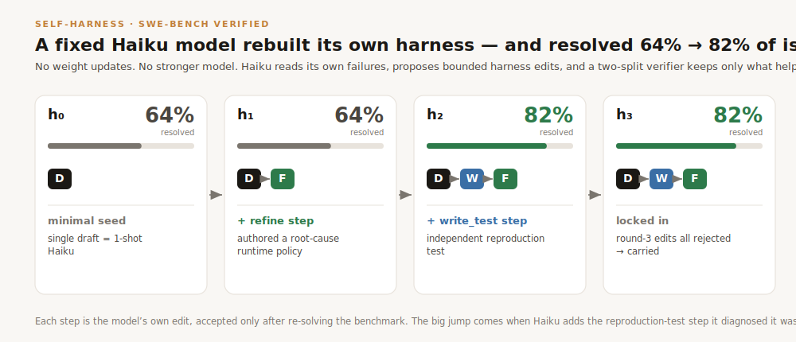
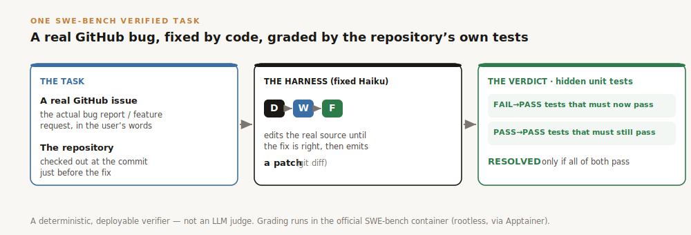
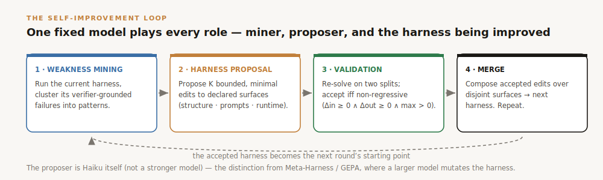
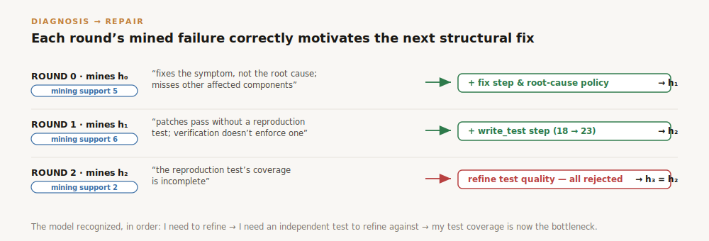
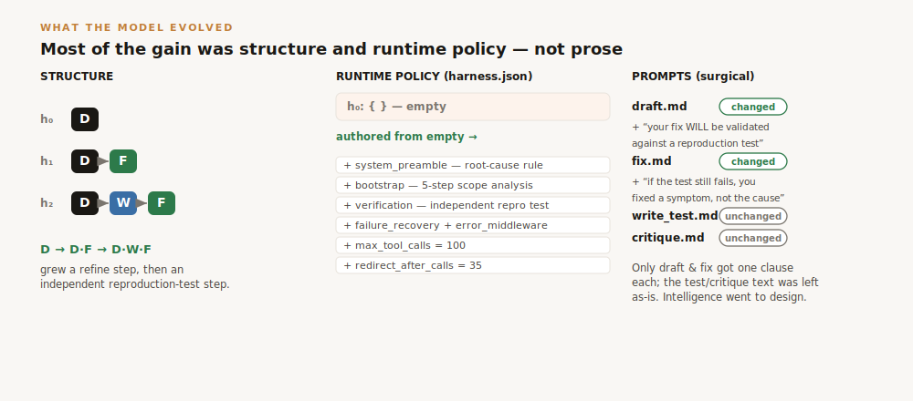

<div align="center">

# Self-Improving Agent Harnesses

### A fixed small model rewrote its own harness and lifted SWE-bench resolution **64% → 82%** — no weight updates, no stronger model

**Give Claude Haiku a minimal one-step harness and let it read its own execution failures. It diagnoses what its scaffold is missing, proposes bounded edits to that scaffold, and a verifier keeps only what helps — rebuilding itself from a single `draft` into a `draft → write_test → fix` loop and resolving 18 → 23 of 28 issues (+28%).**



</div>

---

## In one paragraph

The model's weights are frozen — we can't change *what Haiku knows*. But we can change everything *around* it: how many times it's called, in what order, what it's told at each step, when it must write a test or re-check its work. That wrapper is the **harness**. Normally a human designs it. Here, **the model reads its own mistakes and redesigns its own harness** — and gets measurably better at fixing real GitHub bugs, with no training at all.

## TL;DR

This is [**Self-Harness**](https://arxiv.org/abs/2606.09498) (Zhang et al. 2026) on SWE-bench Verified: the **same fixed model improves the harness it runs inside** — no fine-tuning, and (unlike GEPA / Meta-Harness) **no stronger external model** doing the improving. Starting from a bare single `draft`, Haiku ran three rounds of *mine your failures → propose a bounded harness edit → keep it only if it verifiably helps*, and grew the exact `draft → write_test → fix` structure a human would design.

| Round | Harness | Issues resolved (of 28) | The model's own edit |
|---|---|---:|---|
| h₀ | `draft` | 18 · **64%** | minimal seed (= 1-shot Haiku) |
| h₁ | `draft → fix` | 18 · **64%** | + a refine step & a root-cause runtime policy |
| **h₂** | `draft → write_test → fix` | 23 · **82%** | + an independent reproduction-test step |
| h₃ | `draft → write_test → fix` | 23 · **82%** | round-3 edits all rejected → carried forward |

*Full writeup + receipts: [`cc_swe/SELF_HARNESS.md`](cc_swe/SELF_HARNESS.md) and [`cc_swe/results/self_harness/`](cc_swe/results/self_harness/).*

---

## The benchmark: SWE-bench Verified

[**SWE-bench Verified**](https://openai.com/index/introducing-swe-bench-verified/) is **500 real, human-validated GitHub issues** from widely-used open-source Python libraries. Each task hands the model a genuine **bug report or feature request** (the actual issue text) plus the **repository checked out at the commit just before the fix**. The model must produce a **code patch** that resolves it — and the grading is done by the repository's **own hidden unit tests**, not by an LLM judge:

<div align="center">

</div>

- **FAIL → PASS**: tests that failed before and must now pass (the bug is actually fixed).
- **PASS → PASS**: tests that already passed and must still pass (nothing else broke).
- A task is **resolved** only if *every* test in both sets passes. This unambiguous, deployable verifier is exactly what makes a harness gain measurable — there's no grader to fool.

**The slice we use.** We draw from seven light, deterministic-to-grade libraries — `flask`, `pylint`, `pytest`, `sphinx`, `sympy`, `seaborn`, `xarray` — at natural difficulty (excluding tasks with flaky or network-dependent tests). This run's set is **28 issues**: pytest 6 · sphinx 6 · sympy 6 · pylint 4 · xarray 4 · seaborn 1 · flask 1 (17 rated *"15 min – 1 hour"*, 11 *"< 15 min"* by SWE-bench's human annotators). The model **edits a real checkout**; we derive its patch with `git diff` and run the hidden tests inside the **official SWE-bench container** (rootless, via [Apptainer](https://apptainer.org/)) for a faithful, reproducible verdict.

**A concrete task.** [`pylint-dev__pylint-6528`](https://github.com/pylint-dev/pylint/issues) — *"Pylint does not respect `--ignore` in `--recursive=y` mode."* The fix must make recursive linting honor the ignore settings. It's graded by **4 FAIL→PASS** tests (the ignore behavior now works) plus **171 PASS→PASS** tests (the rest of pylint still works). Haiku's evolved `draft → write_test → fix` harness resolves it; a bare single `draft` does not.

---

## The loop: one model plays every role

<div align="center">

</div>

The proposer is **Haiku itself**, not a larger model — that's the distinction from our earlier BattleSnake study (and from GEPA / Meta-Harness), where a stronger Sonnet mutates the harness. Here the model that *runs* the harness is the same one that *diagnoses and repairs* it.

---

## Why it works: correct self-diagnosis → correct self-repair

The trajectory isn't a lucky walk. Each round's mined failure pattern **correctly motivates the next structural addition**, in the order a human designer would add them:

<div align="center">

</div>

The model recognized, unaided and in sequence: *I need to refine → I need an independent test to refine against → my test coverage is now the bottleneck.*

---

## What actually evolved

<div align="center">

</div>

Most of the improvement was **structure and runtime policy, not prose**. From an empty `harness.json`, Haiku authored a whole root-cause discipline (a global preamble, a 5-step scope-analysis bootstrap, an independent-reproduction-test verification spec, symptom-vs-root-cause failure recovery, and tool-call bounds). The per-role prompts it barely touched — only `draft` and `fix` got one appended clause each.

---

## How it's built

| Piece | Where |
|---|---|
| **Self-Harness controller** — minimal-harness init, the two-split non-regression gate (`accept iff Δin ≥ 0 ∧ Δout ≥ 0 ∧ max > 0`), disjoint-surface merge | [`cc_swe/control_selfharness.py`](cc_swe/control_selfharness.py) |
| **The loop** — Haiku miner → K=3 Haiku proposers → dual-split solve → gate → merge (resumable, cap-guarded) | [`cc_swe/workflow_swe_selfharness.js`](cc_swe/workflow_swe_selfharness.js) |
| **Solving / scoring** — SWE-bench Verified via Apptainer, TRUE `FAIL_TO_PASS + PASS_TO_PASS` resolution | [`cc_swe/control_swe.py`](cc_swe/control_swe.py), [`cc_swe/swe_harness.py`](cc_swe/swe_harness.py) |
| **Writeup + receipts** — trajectory, per-round mining diagnoses, every proposal + gate verdict, evolved `harness.json` & prompt diffs | [`cc_swe/SELF_HARNESS.md`](cc_swe/SELF_HARNESS.md) · [`cc_swe/results/self_harness/`](cc_swe/results/self_harness/) |

Runs on **[Claude Dynamic Workflows](https://docs.claude.com/en/docs/claude-code)** — parallel agent orchestration with structured outputs.

## Caveats (scope of the claim)

- **The 64% → 82% gain is on the held-in set.** On a separately-curated held-out set the evolved champion does **not** separate from 1-shot Haiku — so this demonstrates the **mechanism** (correct self-diagnosis → correct self-repair, unaided), not a generalization or frontier-beating result.
- The in-loop gate ran at R=1; the *structural* trajectory is robust, but individual per-round resolution deltas carry single-draw noise.

---

## Earlier result — evolving harnesses on BattleSnake (small × N beats the frontier)

The project's first study asked a related question with a **stronger** optimizer: can a Sonnet-driven evolutionary search find a Haiku harness that beats a frontier model? **Yes** — an evolved 8-call Haiku harness (`draft ×4 → fix ×4`) reaches **0.719** ladder win-rate, beating single-shot **Opus (0.522)** and **Sonnet (0.442)**, under a verified-acceptance gate and honest, de-inflated evaluation.

<div align="center">

</div>

Key lessons that carried into Self-Harness: **diversify-then-refine** beats naive refinement or sampling; **selection inflation is large** (~0.1–0.3) and must be de-inflated with an independent higher-replication re-eval; and the harness benefit needs a **deployable verifier** and a **beatable** frontier.

**→ Full BattleSnake study: [`battlesnake/README.md`](battlesnake/README.md)** · honest results record: [`results/RESULTS.md`](results/RESULTS.md).

---

## What's in here

| Path | What |
|---|---|
| [`cc_swe/`](cc_swe/) | **Self-Harness on SWE-bench Verified** — controller, the self-improvement workflow, the Apptainer solving backend, the writeup + receipts |
| [`battlesnake/`](battlesnake/) | The earlier **BattleSnake** harness-evolution study (evolved Haiku×8 beats Opus/Sonnet) |
| [`cc_pipe/`](cc_pipe/), [`cc_core/`](cc_core/), [`cc_gepa/`](cc_gepa/), [`cc_decomp/`](cc_decomp/), [`cc_prompt/`](cc_prompt/) | Shared library + the BattleSnake experiment code (simulator, ladder, harness/store/scoring, GEPA & CORE optimizers, verified-acceptance gate) |
| [`results/`](results/) | The honest, de-inflated BattleSnake results record |
| [`assets/`](assets/) | Figures (`self_harness/` = the infographics above) |

---

## Reproduce

```bash
pip install -r requirements.txt
# Self-Harness on SWE-bench Verified (Haiku improves its own harness):
#   see cc_swe/control_selfharness.py + cc_swe/workflow_swe_selfharness.js
# BattleSnake harness evolution (Sonnet evolves a Haiku harness):
#   see battlesnake/README.md + cc_pipe/
```

<sub>Built with Claude Code + Claude Dynamic Workflows.</sub>
