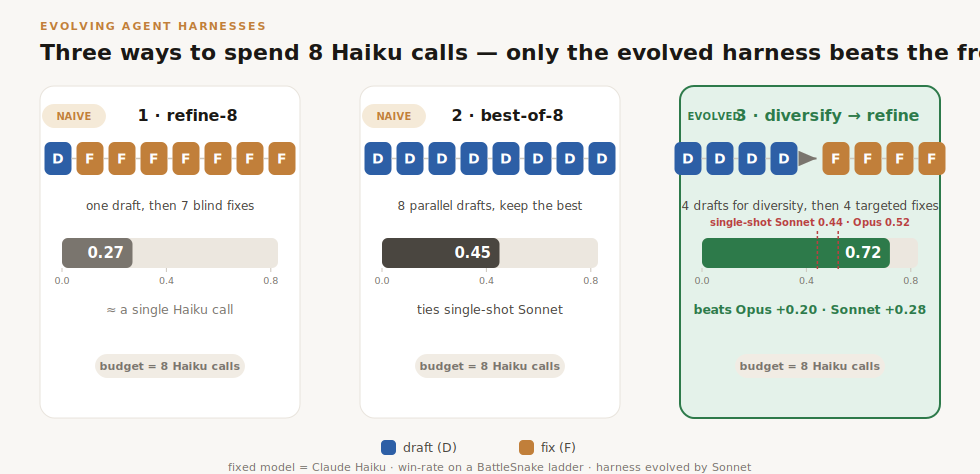
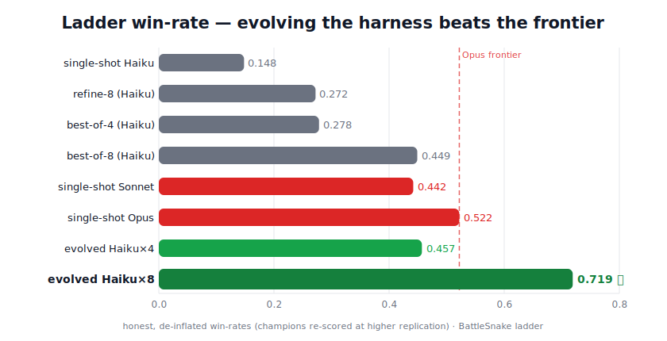
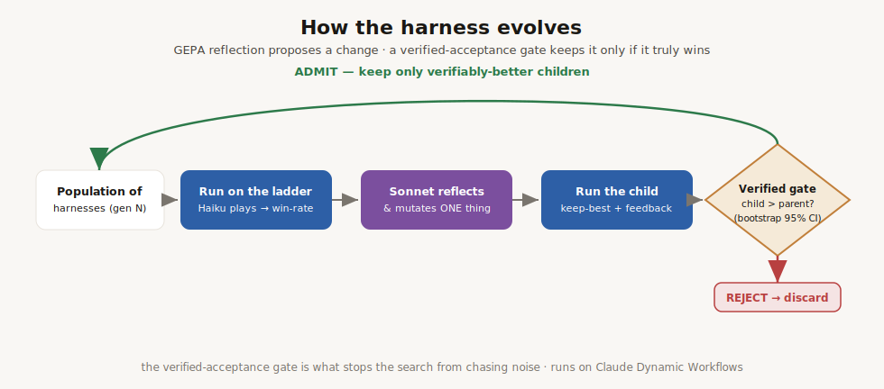
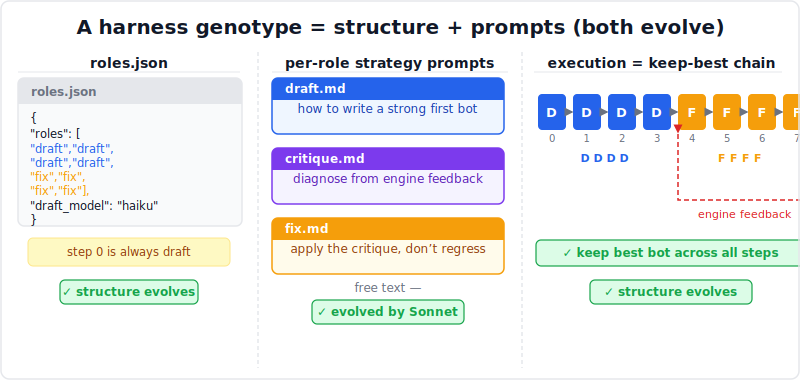

<div align="center">

# Evolving Agent Harnesses
### Make 8 calls of a *small* model beat one call of a *frontier* model — by evolving the harness, not the model

**A fixed small model (Claude Haiku) writes the answer. A reflective optimizer (Claude Sonnet) evolves the _harness_ that structures Haiku's N calls — and a change is kept only if it _verifiably_ beats its parent. The evolved 8-call Haiku harness beats single-shot Opus and Sonnet.**



</div>

---

## TL;DR

We evolve the **harness** — the program that orchestrates a fixed small model's calls — instead of fine-tuning a model. The genotype is a budget-*N* self-correction pipeline (a sequence of `draft` / `critique` / `fix` steps, each with its own prompt). [GEPA](https://arxiv.org/abs/2507.19457)-style reflection (Sonnet) proposes changes; a **verified-acceptance gate** (two-sample bootstrap, 95% CI) admits a change only if it genuinely beats its parent. Fitness = mean win-rate on a BattleSnake ladder, where Haiku writes the bot.

| System (8-call budget unless noted) | Ladder win-rate | |
|---|---:|---|
| single-shot Haiku | 0.148 | small-model floor |
| refine-8 (Haiku, naive sequential) | 0.272 | |
| best-of-8 (Haiku, naive parallel) | 0.449 | ≈ Sonnet |
| single-shot **Sonnet** | 0.442 | frontier |
| single-shot **Opus** | 0.522 | frontier |
| **🏆 evolved Haiku×8** (`D·D·D·D→F·F·F·F`) | **0.719** | **beats Opus by +0.20, Sonnet by +0.28** |
| evolved Haiku×4 (`D·D→F·F`) | 0.457 | ≈ Sonnet parity at half the budget |

*Win-rates are the **honest, de-inflated** figures (champions re-evaluated at higher replication to remove selection bias — see [Honest evaluation](#honest-evaluation-the-thing-most-harness-search-papers-get-wrong)). Frontier bars are single-shot Sonnet/Opus on the same ladder. Full record: [`results/RESULTS.md`](results/RESULTS.md).*

---

## The result: evolution discovers a harness that beats the frontier

The headline figure shows **three different ways to spend 8 Haiku calls**:

1. **Naive refine-8** — `draft → fix → fix → … → fix`. One draft, then seven blind revisions. Blind fixes regress as often as they help: **0.27**, barely above a single Haiku call.
2. **Naive best-of-8** — `draft ×8`, keep the best. Pure diversity, no refinement. Reaches **0.45** — about single-shot Sonnet.
3. **Evolved hybrid** — `draft ×4 → fix ×4`. Four independent drafts for diversity, **then** four targeted fixes (each guided by engine feedback) for refinement. **0.72 — it beats single-shot Opus.**

The evolved winner isn't an exotic structure — it's the **synthesis** of the two naive ideas in the right ratio. Neither pure refinement nor pure sampling reaches the frontier; *diversify-then-refine* does. And the motif is **scale-consistent**: at a 4-call budget the evolved harness is `draft ×2 → fix ×2` (0.46, Sonnet parity); doubling the budget to `draft ×4 → fix ×4` (0.72) clears Opus. **More budget raises the achievable ceiling, and evolution finds the architecture that cashes it in.**

<div align="center">

</div>

---

## How it works

<div align="center">

</div>

**1 · The genotype is a harness, not a weight.** Each individual is a budget-*N* pipeline: `roles.json` (the step sequence in `{draft, critique, fix}`, step 0 always `draft`) plus a free-text **strategy prompt per role**. Both the *structure* and the *prompts* evolve.

<div align="center">

</div>

**2 · Execution is a keep-best chain with real feedback.** Haiku runs the pipeline: `draft`/`fix` steps write a bot (scored by a native Go BattleSnake engine), `critique` reads the engine's failure feedback and diagnoses what to change next. The best bot across the chain is kept.

**3 · The optimizer is reflective (GEPA).** Sonnet reads a parent's metrics + failures and proposes **one** change — retype/reorder a step, or rewrite a single role's prompt — explaining its reasoning.

**4 · Acceptance is _verified_.** A proposed child is only admitted if it beats its parent on a **two-sample bootstrap over pooled per-game outcomes (95% CI)**. This is the load-bearing piece: it's what stops the search from chasing noise.

The whole loop runs on **[Claude Dynamic Workflows](https://docs.claude.com/en/docs/claude-code)** — parallel agent orchestration with structured outputs, resumable and cap-guarded.

---

## Honest evaluation (the thing most harness-search papers get wrong)

Evolution **selects** the offspring with the best measured fitness. With a noisy fitness signal (Haiku has large run-to-run variance), the *max over noisy estimates* is biased **upward** — the optimizer's curse. We caught this directly:

- An R=3-selected 8× champion reported **0.809**; re-evaluated with fresh, higher-replication draws it was **0.598**. Unselected baselines stayed put — only the *selected* numbers regressed.
- So every champion here is **de-inflated**: re-scored at higher replication before any claim. The robust best champion is `g04_00` = **0.719 [0.69, 0.74]**.

A second guard, the **decoupled-admit gate** (explore cheaply, re-evaluate parent-beaters at high replication, admit only on the robust comparison), produces the honest 4× number (0.457). **Report numbers you re-measured, not the ones selection handed you.**

> The same discipline applies to *what you select on*: if the keep-best signal is a weak proxy that overfits, or the frontier is already near-ceiling, the gain won't generalize. The harness benefit shows up only with a **deployable verifier** (a real win-rate / test-execution signal) and a **beatable** frontier.

---

## What's in here

| Path | What |
|---|---|
| [`cc_pipe/`](cc_pipe/) | **The headline experiment** — evolve a typed self-correction **pipeline** (GEPA vs CORE), the verified-acceptance gate, the baselines, and the decoupled-admit re-runs (controller + Claude Dynamic Workflow drivers) |
| [`cc_core/`](cc_core/) | CORE — contrastive winner/loser reflection into a utility-weighted insight bank (the GEPA alternative we compare against) |
| [`cc_gepa/`](cc_gepa/), [`cc_decomp/`](cc_decomp/), [`cc_prompt/`](cc_prompt/) | Shared library — the native BattleSnake simulator + opponent ladder, and the harness / store / scoring / select-admit utilities the pipeline reuses |
| [`BattleSnake/`](BattleSnake/) | Vendored BattleSnake rules-engine source (build the binary locally with `scripts/build_battlesnake.sh`) |
| [`results/`](results/) | The honest, de-inflated results record — [`RESULTS.md`](results/RESULTS.md) + raw machine-readable data in [`results/data/`](results/data/) |
| [`assets/`](assets/) | Figures (drawn by Sonnet) |

---

## Key findings

- **Small × N can beat large × 1 — if you evolve the harness *and* verify acceptance.** Evolved Haiku×8 (0.72) > single-shot Opus (0.52).
- **Diversify-then-refine** beats both naive sequential refinement and naive parallel sampling, and the motif **scales** with budget (4× → Sonnet parity, 8× → beats Opus).
- **Selection inflation is real and large** (~0.1–0.3); de-inflate champions with an independent higher-replication re-eval or you'll report fiction.
- **GEPA ≫ CORE** under honest evaluation: reflective reflect-and-mutate climbs; the contrastive insight-bank variant was selection-inflated and collapsed below best-of-N.
- **Harness benefit is domain-dependent.** It needs a *deployable verifier* (game-engine win-rate here; unit-test execution for code) and a *beatable* frontier — which is exactly why the next experiment is on SWE-bench.

---

## Reproduce

```bash
pip install -r requirements.txt
# headline 8x experiment (BattleSnake; Haiku writes bots, Sonnet evolves the harness)
# see cc_pipe/ for the controller + the Claude Dynamic Workflow driver
```

Caveats, in the open: the headline metric is **BattleSnake ladder win-rate** (one game domain); win-rates are de-inflated point estimates with bootstrap CIs, not multi-seed means across domains; the SWE-bench generalization is still running. The full, unvarnished record — including the bugs we found and fixed — is in [`results/RESULTS.md`](results/RESULTS.md).

<sub>Built with Claude Code + Claude Dynamic Workflows. Figures drawn by Claude Sonnet.</sub>
