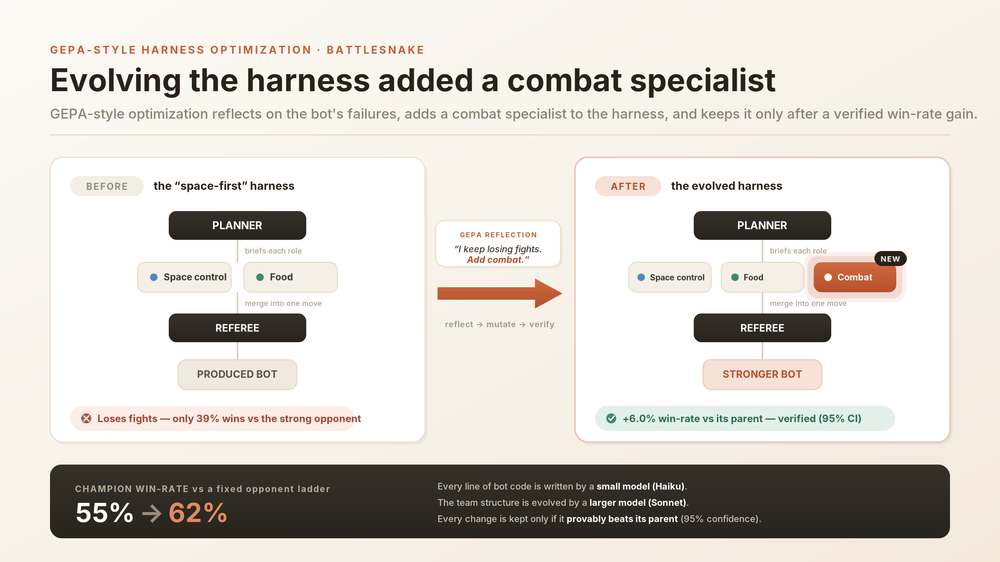
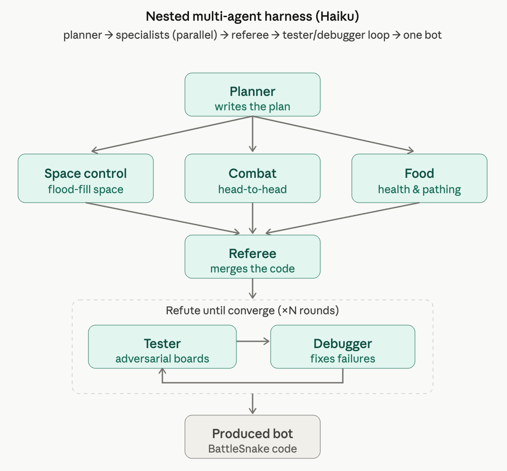
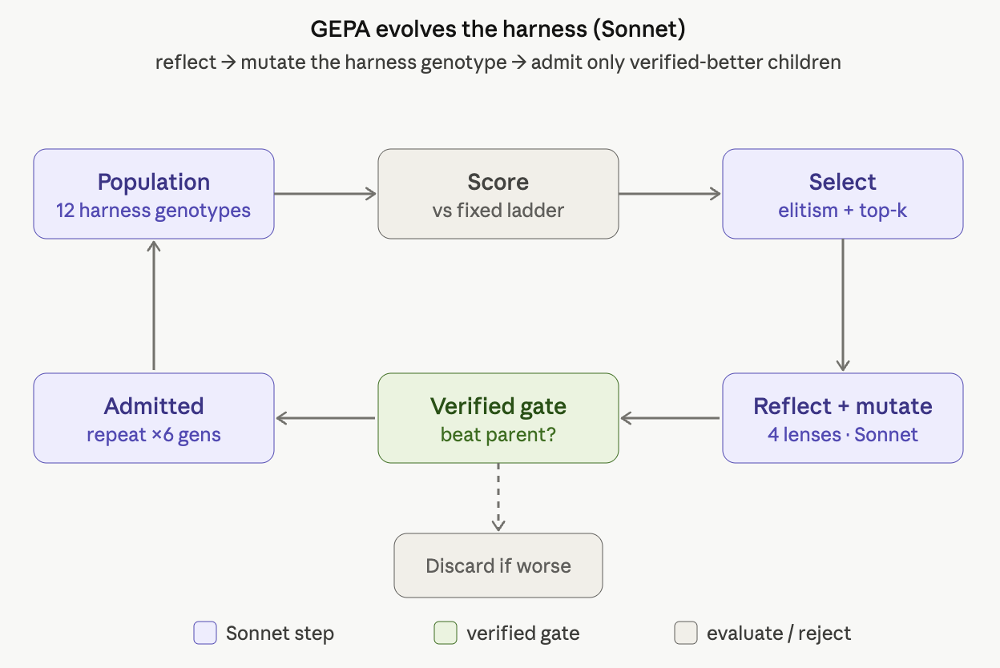
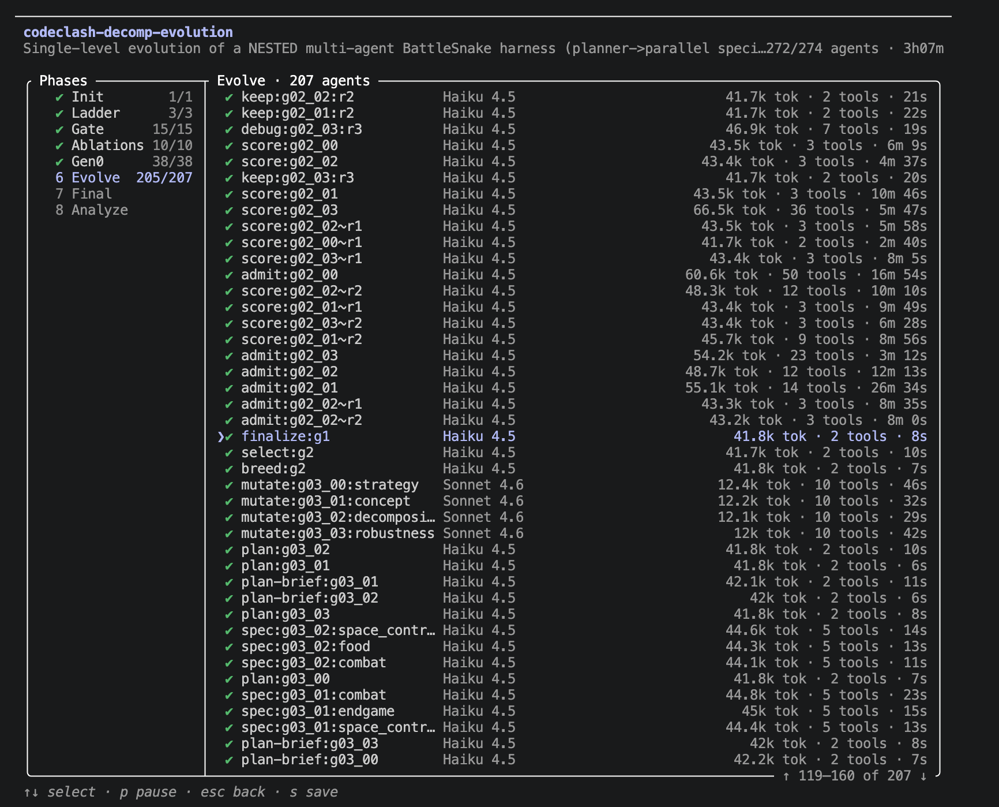
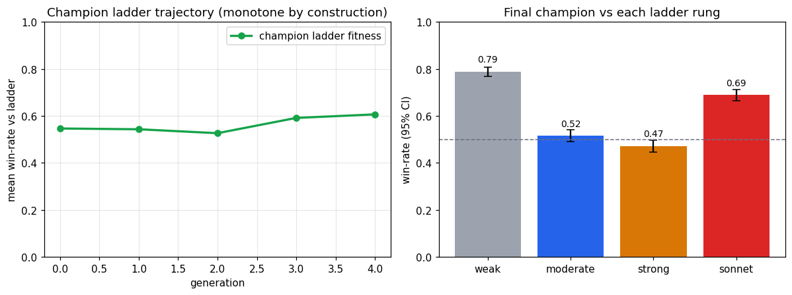
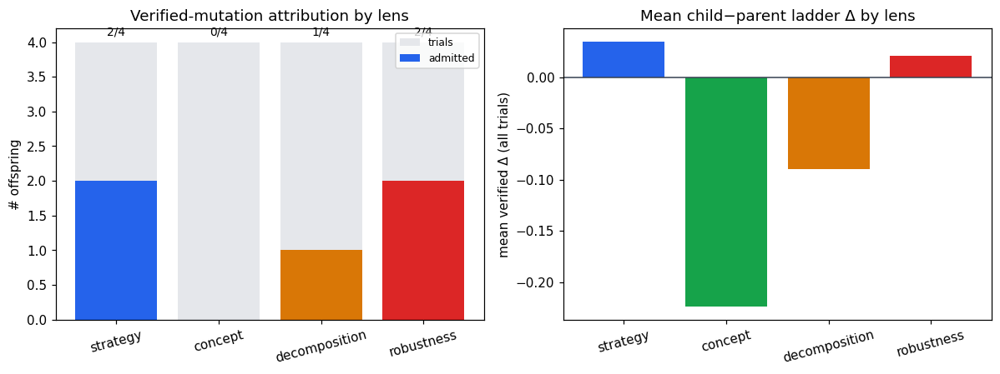

<div align="center">

# Evolving a multi-agent coding harness with GEPA + Claude Dynamic Workflows

**A fixed small model (Haiku) writes BattleSnake bots inside a nested multi-agent _harness_. A GEPA-style optimizer (Sonnet) evolves the harness — and keeps a change only if it _verifiably_ beats its parent.**



</div>

---

## TL;DR

- **The harness is a nested multi-agent pipeline** — a *planner* fans out parallel *specialist coders*, a *referee* merges their code, and a *verified refine loop* hardens it. This whole pipeline is **one Claude Dynamic Workflow**, and every agent in it is a small model (**Haiku**).
- **The optimizer is GEPA-style** — a larger model (**Sonnet**) *reflects* on where the bot loses, *mutates* the harness, and a **verified-acceptance gate** admits a child only if a paired, common-seed comparison shows it beats its parent (95% CI strictly above zero). Regressions are never admitted.
- **It works.** The evolved harness's bot beats a plain iterative-refinement baseline **0.62 → 0.08** (and best-of-8 → 0.21) on a fixed opponent ladder, and the champion climbed via a single verified edit: **it added a `combat` specialist** after diagnosing weak head-to-head play.
- **No Opus inside the loop.** Haiku does all the coding; Sonnet does the evolving; Opus only orchestrates. Models are used where they're cheap and strong.

> The headline image above is the real, grounded story of the single winning mutation. Everything below is reproducible from this repo.

---

## 1. How one bot gets built — Claude Dynamic Workflows

A *harness* doesn't search a population to make a bot. It **decomposes the job** across specialist sub-agents and then hardens the result. One harness run is a nested [Claude Dynamic Workflow](https://docs.claude.com/en/docs/claude-code):

<div align="center">

</div>

1. **Planner** (Haiku) reads the strategy framing and writes a short brief for each active specialist.
2. **Specialist coders** (Haiku, **in parallel** — the fan-out) each write one scoring function: `score(game_state) -> {up, down, left, right}`, where `-1e9` vetoes an unsafe move. The active set is drawn from a fixed menu: `space_control · combat · food · endgame · hazard`.
3. **Referee** merges them into one `move()` — by deterministic policy (`weighted_vote` / `priority_order`) or by a Haiku-written integrator (`planner_merge`).
4. **Verified refine loop** (`refute → fix → keep-if-not-worse`, ×N): a **tester** surfaces failing boards, a **debugger** fixes the weakest specialist, and the edit is kept only if it doesn't regress.

Two engineering details make this robust: each specialist is **sandboxed in its own namespace** (a crash is isolated, not contagious), and the referee has a **non-suicidal floor** (it never moves the snake into a body when a safe move exists). The result is one self-contained BattleSnake bot — the harness's *phenotype*.

**Why this is the Dynamic-Workflows showcase:** the depth lives in *execution*. A single workflow deterministically fans out, integrates, and loops over many small-model sub-agents — the orchestration is code, the work is agents.

---

## 2. How the harness is optimized — GEPA

The two things that *evolve* are kept deliberately small for statistical power:

- **`planner_prompt`** — the strategy framing + how the planner briefs specialists.
- **`decomposition`** — which specialists are active, the referee policy, whether the tester is on, and the refine depth.

A single evolutionary loop ([GEPA](https://arxiv.org/abs/2507.19457)-style: *reflect → mutate → keep only Pareto/verified improvements*) optimizes them. Here the larger model (Sonnet) does the reflecting and mutating:

<div align="center">

</div>

1. **Score** every harness's bot against a **fixed opponent ladder** (held-out; never the evolving population).
2. **Select** survivors by ladder fitness (the champion is always retained — elitism).
3. **Reflect + mutate** (Sonnet) through four lenses, each making one *incremental, single-aspect* edit: `strategy` (reframe the prompt) · `concept` (add a missing idea) · `decomposition` (one structural change) · `robustness` (toggle tester / refine depth).
4. **Verified-acceptance gate** — run the child's harness, then admit it **only if** a paired, common-seed comparison of child-vs-parent has a 95% bootstrap CI **strictly above 0**. Otherwise discard it.

Because regressions are never admitted and the champion is always kept, the champion's fitness is **monotone by construction** — the curve shows *that a real improvement was found and verified*, not a noisy hill-climb.

> *Figure note:* the diagram shows GEPA's default scale (12 genotypes × 6 generations). **This run was budget-scaled to 8 genotypes × 4 generations** (everything else as shown).

### The fixed opponent ladder

Fitness is the bot's mean win-rate across four held-out opponents — which gives the search real *headroom*:

| rung | opponent | round-robin win-rate |
|---|---|---|
| 0 · weak | naive food-seeker | 0.24 |
| 1 · moderate | greedy + flood-fill (CodeClash's benchmark) | 0.57 |
| 2 · strong | hand-written: flood-fill + head-to-head + space-guard | 0.68 |
| 3 · Sonnet | one plain-refinement Sonnet bot, frozen | ~0.50 |

---

## 3. It actually ran

This isn't a diagram — it's the real Dynamic Workflow executing: ~270+ sub-agents over ~3 hours, **Haiku** doing every harness step and **Sonnet** doing the mutations (visible per-agent in the model column).

<div align="center">

</div>

---

## 4. The winning mutation (in detail)

The headline image tells it; here are the exact numbers. The champion's lineage traces back to **`space-first`**, a harness with only `[space_control, food]`. It was strong on space but **weak in fights — 39% wins vs the strong rung**. The `decomposition` lens reflected on exactly that and made one change:

> **Added the `combat` specialist** → `[space_control, food, combat]` "to address low win-rates vs moderate (43%) and strong (39%) where head-to-head collision avoidance/targeting was missing."

The planner then briefed the new specialist ("use space advantage to outmaneuver opponents… space denial over aggressive pursuit"), and the verified gate confirmed the gain:

- **Verified Δ = +0.060, 95% CI [+0.020, +0.103]** → admitted.
- Champion ladder fitness climbed **0.547 → 0.617** (best-so-far).

---

## 5. Results

**The contribution test — does the *harness* actually help?** Champion vs both ablations, 1500 games per rung (Wilson 95% CIs), non-overlapping:

| bot | ladder-mean win-rate |
|---|---|
| **evolved champion** | **0.617** [0.604, 0.629] |
| best-of-8 monolithic refinement | 0.214 [0.204, 0.224] |
| single simple-refinement | 0.076 [0.070, 0.083] |

Head-to-head, the champion beats the simple-refinement bot **0.98** and best-of-8 **0.77**. Per-rung it wins **0.79 / 0.52 / 0.47 / 0.69** vs weak / moderate / strong / Sonnet — i.e. it beats the plain-refinement *Sonnet* rung while being built entirely by *Haiku*.

**The verified-acceptance gate, working.** Across the run, **5 of 16 mutations** cleared the CI gate — small, real gains spread across lenses, with no single dominant operator (the `concept` lens never cleared it):

| lens | admitted / tried | mean verified Δ |
|---|---|---|
| strategy | 2 / 4 | +0.07 |
| robustness | 2 / 4 | +0.05 |
| decomposition | 1 / 4 | +0.06 |
| concept | 0 / 4 | — |

<div align="center">
 
</div>

📊 **Full interactive write-ups:** [`assets/report.html`](assets/report.html) (charts + tables) and [`assets/evolution_story.html`](assets/evolution_story.html) (the scrollable story). Raw numbers in [`results/analysis_data.json`](results/analysis_data.json) and [`results/analysis.md`](results/analysis.md).

### Honest caveats

- **Part of the giant ablation gap is *structural*, not evolutionary.** The decomposition scaffold makes bots competent (safety floor + isolated specialists) while a monolithic bot is fragile (the simple-refinement baseline is near-broken at 0.08). The *evolution's own* contribution is the smaller, verified 0.547 → 0.617 climb.
- **n = 1 seed**, budget-scaled (8 genotypes × 4 generations). The method (verified gate, ladder anchoring, all-four-lenses) is fully exercised; ≥3 seeds would be the cheapest path to a stronger claim.
- **The Sonnet rung is a plain-refinement bot** (~0.50). Beating it means *evolved-Haiku-harness ≥ plain-refinement-Sonnet* — a fair, bounded claim; no transfer to Sonnet is implied.

---

## 6. Repository layout

```
cc_decomp/            the system
  control.py          deterministic "brain": ladder scoring, the paired-CI gate,
                      refine loop, generation reconciliation, verification gate
  harness.py          the decomposition adapter (assembly, contracts, tester)
  seeds.py            12 diverse seed harnesses (incl. deliberately weak ones)
  ladder/             hand-written weak + strong opponent rungs
  workflow.js         the Claude Dynamic Workflow orchestrator
  analysis.py viz.py  analysis.md + report.html + figures
  reeval.py           token-free, contention-free reliable re-evaluation
  _mocktest.py        token-free end-to-end test of the controller
cc_gepa/              reused native BattleSnake sim layer (HTTP bots, the engine runner)
results/              the evolved harnesses (genotypes + produced bots + metrics) + analysis
assets/               figures + report.html + evolution_story.html
docs/workflow_spec.md the full experiment specification
```

**The genotype is two text components** you can read directly, e.g. the champion at
[`results/gen_03/genotypes/agent_g03_02/`](results/gen_03/genotypes/agent_g03_02) — its `decomposition.json`, the planner's `briefs.json`, and the three evolved `specialists/*.py`.

---

## 7. Run it yourself

The simulation reuses the official **BattleSnake** rules engine (via [CodeClash](https://github.com/CodeClash-ai/CodeClash), MIT) and runs bots natively over HTTP — no Docker.

```bash
# 1. deps (analysis + figures; the sim core is stdlib only)
pip install -r requirements.txt

# 2. build the BattleSnake rules engine and place the binary at  BattleSnake/game/battlesnake
#    (clone github.com/CodeClash-ai/BattleSnake — the official Battlesnake rules — and `go build`)

# 3. token-free end-to-end test of the controller (no model calls)
python3 -m cc_decomp._mocktest

# 4. reliable, contention-free recompute of all results from the saved harnesses (token-free)
python3 -m cc_decomp.reeval --out results --sims-evolve 150 --sims-admit 240 --sims-final 1500
```

**Reproducing the full LLM evolution** runs `cc_decomp/workflow.js` through Claude Code's Dynamic Workflows (it spawns the Haiku/Sonnet sub-agents). Set `ccroot` to your repo path and launch the `Workflow` with knobs, e.g.
`{ "ccroot": "/abs/path/to/this/repo", "out": "/abs/path/to/this/repo/cc_decomp_evo", "pop": 8, "generations": 4, "refine_rounds": 2 }`.

> ⚠️ Native sims spin up many subprocesses. Keep per-call worker parallelism well under your core count (`MAXW` in `control.py`) or concurrent runs oversubscribe the CPU, BotServers miss their readiness window, and the paired gate silently corrupts. `reeval.py` runs sequentially for exactly this reason.

---

## Credits & license

- **BattleSnake rules engine** — [CodeClash-ai/BattleSnake](https://github.com/CodeClash-ai/BattleSnake) (the official [Battlesnake](https://github.com/BattlesnakeOfficial/rules) rules), used via [CodeClash](https://github.com/CodeClash-ai/CodeClash) (MIT). The arena/HTTP-bot protocol is reused natively (no Docker); game semantics are unchanged.
- **GEPA** — [*GEPA: Reflective Prompt Evolution Can Outperform Reinforcement Learning*](https://arxiv.org/abs/2507.19457) (Agrawal et al., 2025) and its implementation [gepa-ai/gepa](https://github.com/gepa-ai/gepa) — the optimization style this builds on (here applied to a multi-agent harness rather than a single prompt).
- **Claude Dynamic Workflows / Claude Code** — the orchestration substrate that runs the nested harness and the evolutionary loop.

Released under the [MIT License](LICENSE).
